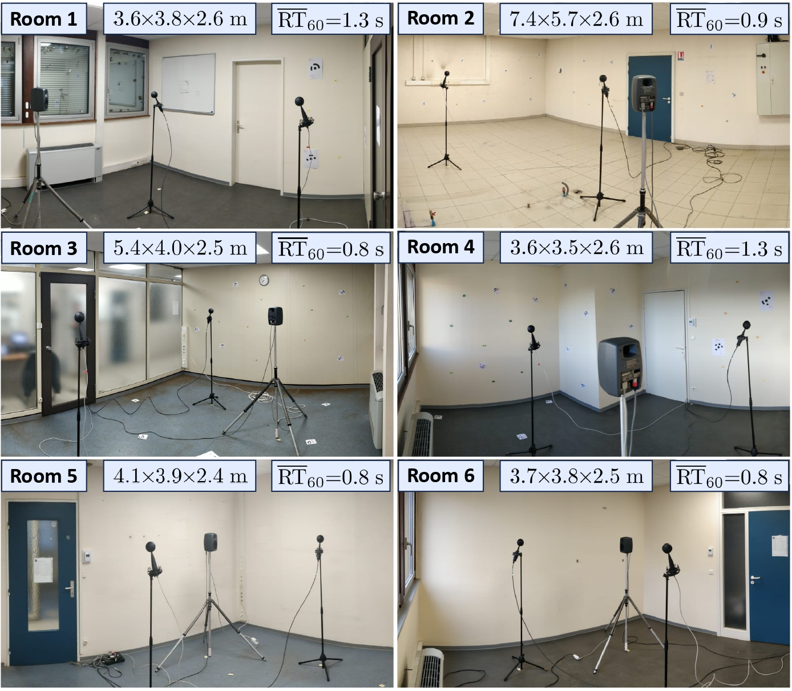

# ARPEGE: Dataset and Methods for Estimating Acoustic and Geometric Room Parameters from Sound

This repository provides scripts to visualize data from **ARPEGE: Dataset and Methods for Estimating Acoustic and Geometric Room Parameters from Sound**.

More details can be found in our paper submitted to **IWAENC 2026**: [arXiv paper]

The dataset is available on the associated Zenodo page: https://zenodo.org/records/20344913

The measurements were carried out using a **Genelec 8020** loudspeaker and the **Eigenmike32** and **Eigenmike64** microphone arrays. The directivity patterns of the Genelec 8020 and EM32 are included in the **pyroomacoustics** toolbox: https://github.com/LCAV/pyroomacoustics

This repository includes example scripts to extract the required data, visualize the source and microphone positions for all measurement positions, and resimulate the measurements using the pyroomacoustics toolbox.

## Related Work

If you want to reproduce the results reported in our paper, please refer to our companion repository for image source localization: https://github.com/jdpascal/Real2Sim_RIRs

In particular, the `config.py` file describes the architecture used to obtain the reported results. Please use this file as the configuration for your evaluation on this dataset after generating your dataset set with the script here.

For volume, surface area, and RT60 estimation from speech, please also refer to this repository: https://github.com/prerak23/RoomParamEstim

## Citation

Please cite our work using the BibTeX entry from the arXiv paper. The citation will be available soon.

## 

    # Copyright (C) 2025  Jean-Daniel PASCAL PRIETO

    # This program is free software: you can redistribute it and/or modify
    # it under the terms of the GNU General Public License as published by
    # the Free Software Foundation, either version 3 of the License, or
    # (at your option) any later version.

    # This program is distributed in the hope that it will be useful,
    # but WITHOUT ANY WARRANTY; without even the implied warranty of
    # MERCHANTABILITY or FITNESS FOR A PARTICULAR PURPOSE.  See the
    # GNU General Public License for more details.

    # You should have received a copy of the GNU General Public License
    # along with this program.  If not, see <https://www.gnu.org/licenses/>.
